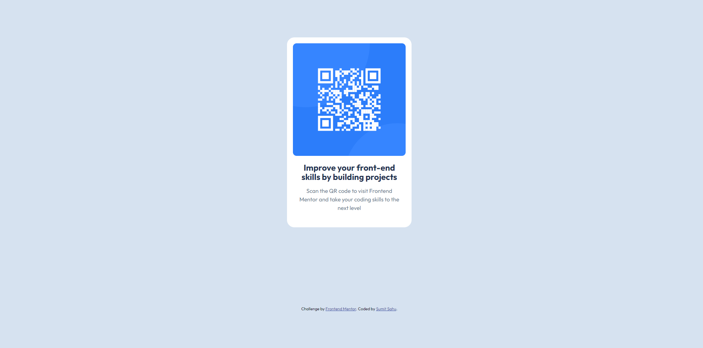

# Frontend Mentor - QR code component solution

This is a solution to the [QR code component challenge on Frontend Mentor](https://www.frontendmentor.io/challenges/qr-code-component-iux_sIO_H). Frontend Mentor challenges help you improve your coding skills by building realistic projects. 

## Table of contents

- [Overview](#overview)
  - [Screenshot](#screenshot)
  - [Links](#links)
- [Author](#author)
- [Acknowledgments](#acknowledgments)

## Overview

### Screenshot

### Links

- Solution URL: [Here is my solution URL](https://github.com/sumitsah/qr-code-component)
- Live Site URL: [Here is live site URL](https://astonishing-horse-807431.netlify.app/)

## My process

### Built with

- Semantic HTML5 markup
- CSS custom properties
- CSS Grid
- Mobile-first workflow

## Author

- Website - [Sumit Sahu](https://www.linkedin.com/in/sumit-sahu-29064377/)
- Frontend Mentor - [@sumitsah](https://www.frontendmentor.io/profile/sumitsah)
